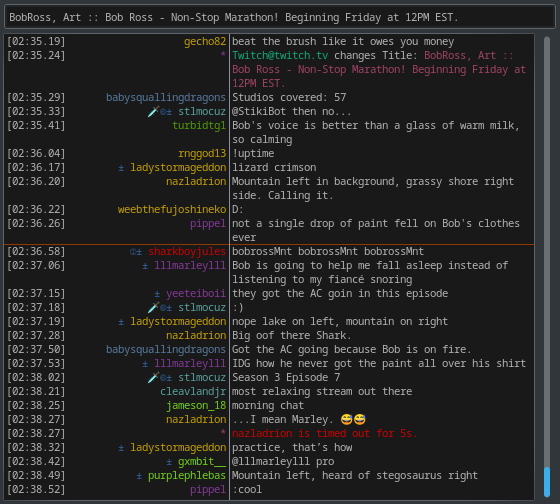
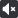
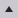
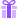

[](https://opensource.org/licenses/GPL-3.0)

# HexTwitch: Rust Edition

***NOTE: This Plugin can ONLY be used with a modified version of HexChat. The Patch File is included in this Repository at `./hex.patch`.***

This is a Plugin for [HexChat](https://github.com/hexchat/hexchat) which aims to integrate some of the more advanced features of the [Twitch](https://twitch.tv) Chat IRC bridge; Specifically, user Badges and channel events such as Subscriptions. This information is supplied via IRCv3 Tags.



There are various IRC clients built specifically for Twitch, such as [Chatty](https://github.com/chatty/chatty), but none seem to compare to HexChat in terms of performance. This is, therefore, an attempt to rework HexChat into a Twitch chat client, without altering its behavior on other IRC Networks.

One problem, however, stands in the way: The HexChat Plugin interface does not provide Callbacks with the IRC Tags. Therefore we must modify HexChat to add this functionality, using the Patch File mentioned above (This could be submitted as a Pull Request, but currently, my C sucks and I would rather not waste their time).

## Patching HexChat

With [Git](https://git-scm.com) and [GNU Patch](https://savannah.gnu.org/projects/patch) installed, the following commands should download and patch the latest HexChat source code:

```
git clone https://github.com/hexchat/hexchat.git build/hexchat
patch -p0 -d build/hexchat -i ../../hex.patch
```

When the patch is applied, you can then [build and install HexChat as normal](https://hexchat.readthedocs.io/en/latest/building.html) from its directory at `build/hexchat/`.

## Building the Plugin

You will need to have [Cargo](https://github.com/rust-lang/cargo) installed. Cargo can be installed and set up easily with [RustUp](https://rustup.rs/). When this is done, run the following command in the Directory where you unpacked this Repository:

```
cargo build --release
```

After Cargo compiles the plugin, its Binary should be in `target/release/`, and should be named something like `libhextwitch` or `libhextwitch.so`. Move this File into the `addons` Directory in your HexChat config Directory; On Linux, this should be at `$XDG_CONFIG_HOME/hexchat/addons/`.

If you have not patched HexChat, it will probably crash. Otherwise, you should now have Twitch features.


## Badge Icons

It is not currently feasible to embed images inline in HexChat without creating a custom font. In lieu of that potential far-future solution, and to keep installation as simple as possible, Twitch user badges are mapped to Unicode codepoints, as detailed in the following lists.

Badges without a codepoint specified will be rendered as `?`. A list of all unknown badge names can be viewed with the `/UNKNOWNS` command. This information should be provided as an Issue in this repository, so that they can be added to the plugin.

Note that some typefaces may render some of these characters in an Emoji style, which may clash somewhat with the rest of the interface.

### Global
- `🜨` (): Twitch staff.
- `⛨` (): Twitch administrator.
- `✓` (): Twitch partner.
- `a` (): Community "Ambassador", handpicked by Twitch.
- `Δ` (): This account is registered with Twitch as a game developer or publisher.
- `+` (): Twitch Turbo member.
- `±` (): Twitch Prime member.
- `~` (): User has taken the "GLHF Pledge".
- `g` (): User has attended GlitchCon.
- `c` (): User has attended TwitchCon.
- `w` (): Overwatch League "Insider".
- `G`: This icon represents various game-specific badges.

### Channel-specific
- `🜲` (): User is the Broadcaster, the owner of the channel.
- `🗡` (): User is a Moderator of this channel with additional powers, handpicked by the Broadcaster.
- `⚑` (): User is a VIP of this channel, handpicked by the Broadcaster.
- `ⲷ` (): User was one of the first subscribers to this channel.
- `α` (): User has contributed art or media to this channel.
- `m` (,,,,): User was active in chat for a notable event, chosen by the Broadcaster.
- `.` (,): User has contributed to a Hype Train in this channel.
- `Ⓐ` (): User is watching the stream with no audio.
- `Ⓥ` (): User is listening to the stream with no video.

### Cheering/Bits
- `*` (): User is an anonymous cheerer.
- `❖` (,,): User is one of the top three cheerers in this channel.
- `🝔` (): User has given bits with the `#charity` tag.
- `▴` (): User has given at least 1 bit ($0.01).
- `⬧` (): User has given at least 100 bits ($1.00).
- `⬠` (): User has given at least 1,000 bits ($10.00).
- `⬡` (): User has given at least 5,000 bits ($50.00).
- `🟋` (): User has given at least 10,000 bits ($100.00).
- `🟎` (): User has given at least 100,000 bits ($1,000.00).

### Subscriptions ()
- `⁘` (,,): User is one of the top three givers of gift subscriptions in this channel.
- `:` (): User has given gift subscriptions in this channel.
- Double-circled digits (`⓵`,`⓷`,`⓺`,`⓽`) are used to represent subscriptions below 1 year.
- Roman Numerals (`ⅰ`,`ⅱ`,`ⅲ`,`ⅳ`,`ⅴ`,`ⅵ`,`ⅶ`,`ⅷ`,`ⅸ`,`ⅹ`,`ⅺ`,`ⅻ`) are used to represent subscriptions of 1 year up to 12 years.
- Inverted circled numbers `⓭` through `⓴` are used to represent subscriptions longer than 12 years.
- `⁑`: User is a subscriber of at least 21 years. This one should not show up for quite a while.

### Channel Points Predictions
- `❶`–`❿` (–): User has bet channel points on a blue prediction, with up to 10 possible outcomes.
- `❶`/`❷` (,): User has bet channel points on a blue/pink prediction, with only two possible outcomes.
- `⧲`/`⧳` (,): User has bet channel points on a gray prediction, with only two possible outcomes.
- `p`: This codepoint represents an unknown Prediction badge, likely because Twitch added a new one again. If this is seen, an Issue should be opened in this repository, including the output of running the `/UNKNOWNS` command.


[Breeze Icons](https://develop.kde.org/frameworks/breeze-icons/) used for HexChat GUI menu items © KDE, licensed under the GNU LGPL 3 or later.
